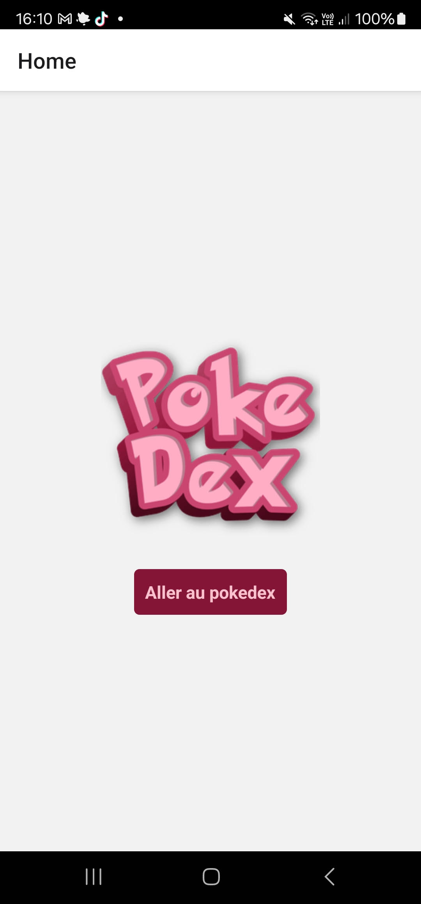

# Comment installer et utiliser Pokedex 


### Installer le projet :
```
npm install
```

### Connecter le téléphone : 
Si tu utilises un téléphone pour lancer le projet :
- Se mettre en mode développeur
- Activer le débogage USB
- Désactiver le bloqueur automatique

Voir si le téléphone est connecté avec :
```
adb devices
```

Si le téléphone n'est pas reconnu : 
- Changer de cable
- Installer driver en fonction du téléphone (exemple driver samsung)

### Démarrage du projet :
Maintenant que le téléphone est connecté : 

Démarrer le serveur :
```
npm start
```
Build le projet :
```
npm run android
```

Vous devirez voir ceci sur votre app :



### Utilisation de Pokedex

Depuis la HomePage vous pouvez decouvrir le pokedex. 
Une fois sur le pokedex, vous pouvez charger plus de pokémon.
Cliquez sur un pokemon pour voir son détail.

### API 

Un lien vers l'api https://pokeapi.co/